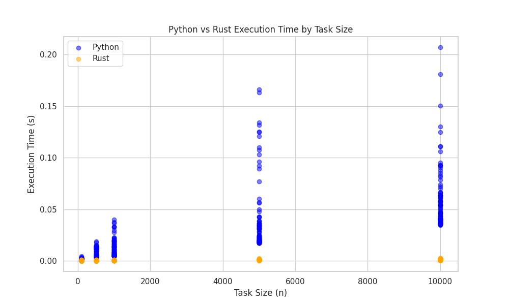
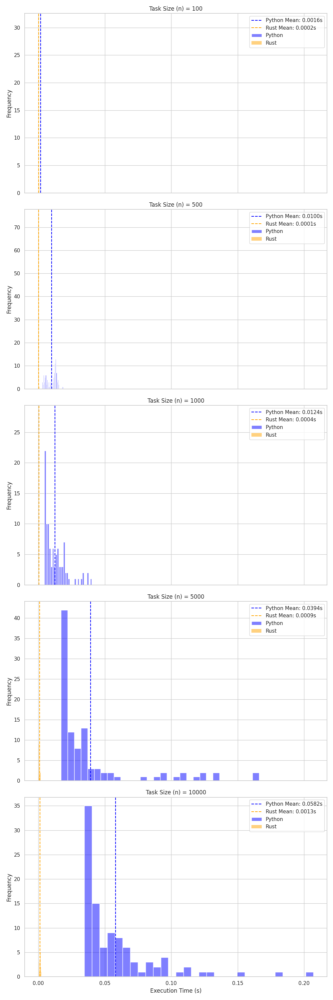

# rust-parallel-with-python

## Comparison

I compare the performance of parallel processing between Rust and Python.




(Warn: You have to learn how to implement parallel processing in Rust because it is worse than Python if you don't know how to use it.)

## SetUp

```shell
sudo apt-get update
sudo apt-get install python3.11-dev

cargo build
uv run maturin develop

uv run main.py
```

## Reference

- [恐れるな！並行性 - The Rust Programming Language 日本語版](https://doc.rust-jp.rs/book-ja/ch16-00-concurrency.html)
- [Tutorial - Maturin User Guide](https://www.maturin.rs/tutorial#use-maturin-new)
- [ThreadPoolBuilder in rayon - Rust](https://docs.rs/rayon/latest/rayon/struct.ThreadPoolBuilder.html)
- [concurrent.futures --- 並列タスク実行 — Python 3.13.0 ドキュメント](https://docs.python.org/ja/3/library/concurrent.futures.html#concurrent.futures.ThreadPoolExecutor)
